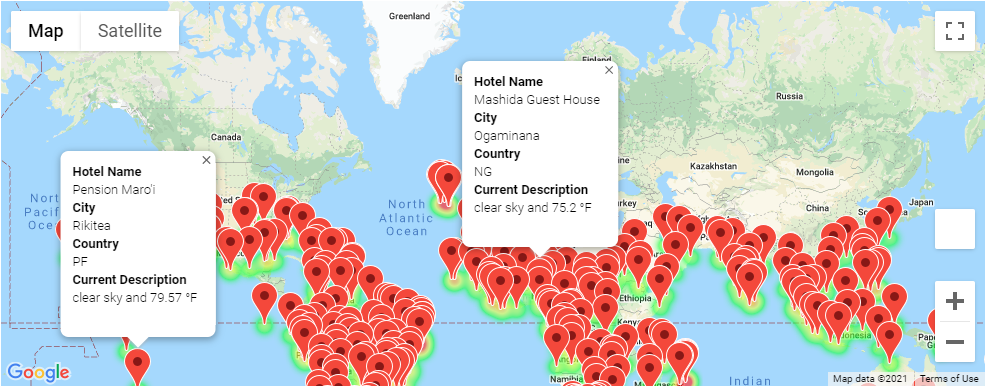
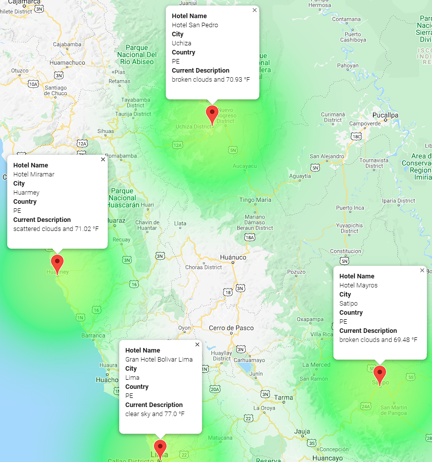

# World_Weather_Analysis
# Analysis of Weather Data
> Python script written & managed in Jupyter Notebook using Google Maps and OpenWeatherMap APIs to generate a travel itinerary based on weather preferences.

## Overview of Weather Analysis
> Data filtered by users input based on weather preferences to create heat maps with markers displaying weather information and suggested hotels for various cities.  

### Results
> World Weather Summary

    - Marker layer map using Google Maps API displaying hotel, weather, and location information. 

    - Marker layer map using Google Maps API displaying hotel, weather, and location information for a 4 city travel route. 

## Summary
> Implementing these changes to the PlanMyTrip app increases the usability of the app. Users are prompted for their preferred minimum and maximum temperatures and given a list of destinations meeting those criteria. Chosen cities can be used to create a travel itinerary which can be used to output a travel route in Google Maps with hotel, weather, and location information for each stop on the itinerary. 